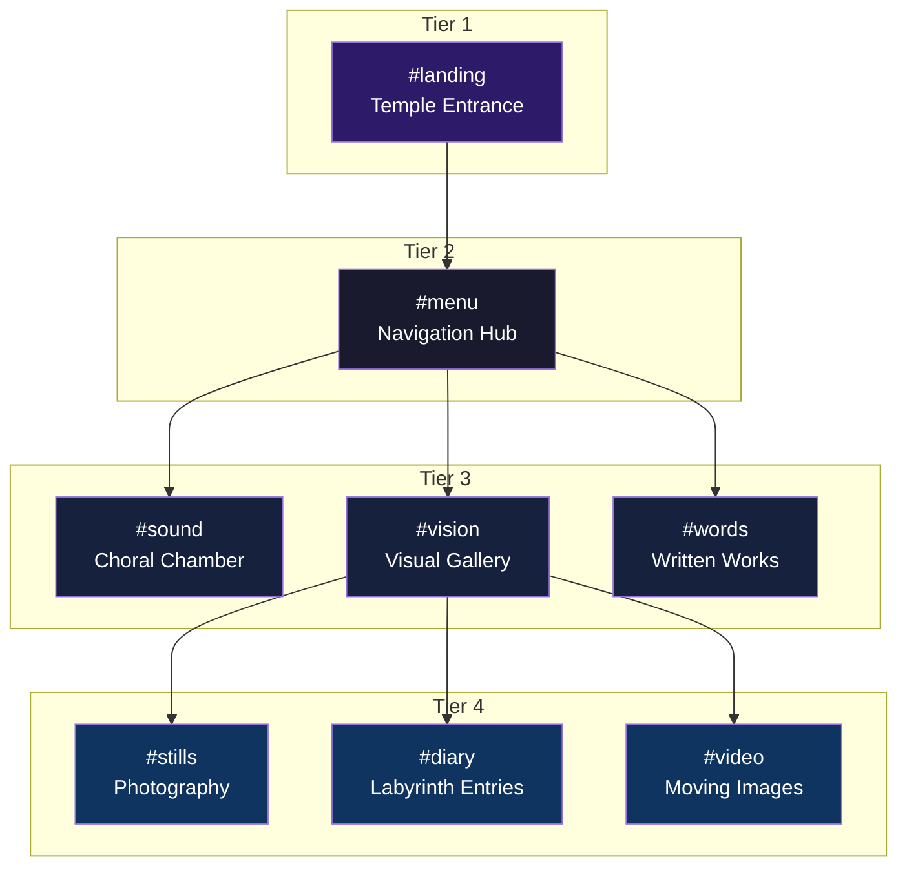

<div align="center">


# ETCETER4 - THE PANTHEON

[](https://github.com/ivviiviivvi/a-mavs-olevm/actions/workflows/ci-cd.yml)
[](LICENSE)
[](https://nodejs.org/)
[](https://developer.mozilla.org/en-US/docs/Web/JavaScript)

</div>

**A Living Temple of Art, Sound, and Words**

> _"The temple breathes"_ - An experimental digital sanctuary where art, sound, and code converge.

This is the website for etceter4.com - a multi-dimensional artistic platform built on classical architectural principles. ET CETER4 is a composer of sounds/words/images, operating across four professional facets: **Academic**, **Professor**, **Designer**, and **Artist**.

## 🏛️ The Pantheon: Five Pillars Architecture

The site is structured as a complete **PANTHEON** - a sacred temple complex with five core pillars, each serving distinct artistic and intellectual functions:

### 1. **MUSEUM** (μουσεῖον - Mouseion) - Preservation

- Preserves artistic journey from 2010-present
- Chronological organization of all work
- Timeline visualization and archival navigation
- Professional curatorial presentation

### 2. **MAUSOLEUM** (μαυσωλεῖον - Mausoleion) - Honor

- Sacred spaces for completed work
- Hall of Albums (complete releases)
- OGOD Monument (29-page visual album)
- Diary Chamber (labyrinth entries)
- Contemplative memorial spaces

### 3. **LABYRINTH** (λαβύρινθος - Labyrinthos) - Exploration

- Non-linear navigation and discovery
- Hash-based routing (#words, #vision, #sound)
- Interconnected content pathways
- Original vision of exploratory web experience

### 4. **CHORAL CHAMBER** (χορός - Choros) - Sound/Music

- Musical compositions and albums
- Sound installations and audio experiments
- Voice and choral works
- Living music archive

### 5. **ATELIER** (Old French - Workshop) - Creation

- Active creation and experimentation
- Work-in-progress showcase
- Living art and ongoing projects
- Dynamic, evolving content

### The Living Pantheon

Inspired by Radiohead's Kid A & Hail to the Thief era websites, the Pantheon is a **living, breathing organism** - constantly shifting, morphing, and evolving. The temple breathes with subtle animations, generative elements, and hidden discoveries, creating an experience that is never quite the same twice.

### Navigation Architecture



## 🚀 Quick Start

**Get running in 30 seconds:**

```bash
git clone https://github.com/ivviiviivvi/a-mavs-olevm.git && cd a-mavs-olevm && npm install && npm run dev
```

Open [http://localhost:3000](http://localhost:3000) in your browser.

### Prerequisites

- **Node.js** 18+ and **npm** 9+
- **Git** for version control

### Development Setup (Step by Step)

1. **Clone the repository**

   ```bash
   git clone https://github.com/ivviiviivvi/a-mavs-olevm.git
   cd a-mavs-olevm
   ```

2. **Install dependencies**

   ```bash
   npm install
   ```

3. **Start development server**

   ```bash
   npm run dev
   ```

   This will start a local server at `http://localhost:3000` with hot reloading enabled.

### Available Scripts

- `npm run dev` - Start development server with live reload
- `npm run lint` - Check code quality with ESLint
- `npm run lint:fix` - Auto-fix linting issues
- `npm run format` - Format code with Prettier
- `npm run format:check` - Check if code is properly formatted
- `npm run validate:package-lock` - Validate package-lock.json consistency

## 🛠 Technology Stack

- **Frontend**: Vanilla JavaScript (ES6+), HTML5, CSS3
- **CSS Framework**: Tachyons for utility-first CSS
- **JavaScript Libraries**: jQuery 3.7+, Velocity.js 2.0+
- **Development**: ESLint, Prettier, Browser-sync
- **CI/CD**: GitHub Actions
- **Deployment**: GitHub Pages

## 📁 Project Structure

The Pantheon is organized as a temple complex with distinct chambers:

```
etceter4/
├── css/                    # Stylesheets
│   ├── styles.css         # Main styles
│   └── vendor/            # Third-party CSS (Tachyons)
├── js/                    # JavaScript modules
│   ├── main.js            # Core application logic
│   ├── page.js            # Page management system
│   ├── pageData.js        # Content data structure
│   ├── images.js          # Image handling
│   ├── diary.js           # Labyrinth diary entries
│   ├── ogod.js            # OGOD visual album
│   └── analytics.js       # Analytics integration
├── img/                   # Visual assets and artwork
├── audio/                 # Sound files and compositions
├── video/                 # Video content
├── labyrinth/             # Diary entries (HTML pages)
├── ogod/                  # OGOD Monument files
├── akademia/              # Academic/professional chamber
├── fonts/                 # Custom typography
├── docs/                  # Documentation
└── index.html             # Temple entrance (main entry point)
```

## 🌟 Core Concepts

### The Expanded Pantheon

Beyond the five core pillars, the Pantheon includes additional chambers:

- **AKADEMIA** - Academic CV, teaching, research, professional work
- **AGORA** - Political discourse and cultural commentary
- **SYMPOSIUM** - Collaborative and social spaces
- **ORACLE** - Divination, randomness, and AI integration
- **GYMNASIUM** - Skills, exercises, experiments
- **NECROPOLIS** - Archive of abandoned/dead projects

### Professional Facets

ET CETER4 operates across four interconnected professional identities:

1. **ACADEMIC** - Researcher, scholar, theorist
2. **PROFESSOR** - Teacher, mentor, curriculum designer
3. **DESIGNER** - Visual designer, UX/UI, web design
4. **ARTIST** - Composer, multimedia artist, experimental creator

## 🔧 Development Guidelines

### Code Style

- Use modern JavaScript (ES6+) features
- Prefer `const` and `let` over `var`
- Follow the configured ESLint and Prettier rules
- Use meaningful variable and function names
- See [NAMING_SYSTEM.md](NAMING_SYSTEM.md) for comprehensive naming strategies

### CSS Architecture

- Utility-first approach with Tachyons
- Component-specific styles in `styles.css`
- Responsive design for modern devices
- No IE8 support (modern browsers only)
- Custom properties for theming

### Design Philosophy

- **Living Architecture**: Subtle animations and generative elements
- **Non-linear Navigation**: Multiple pathways through content
- **Breathing Temple**: Constant subtle motion and evolution
- **Hidden Discoveries**: Easter eggs and secret paths
- **Atmospheric Sound**: Ambient audio integration

### Git Workflow

- Create feature branches from `master`
- Use descriptive commit messages
- All PRs require passing CI checks
- Automatic dependency updates via Dependabot

## 🚀 Deployment

The site can be deployed to various hosting platforms. The CI/CD pipeline includes:

1. **Linting & Formatting** - Ensures code quality
2. **Package Lock Validation** - Verifies dependency integrity
3. **Security Audit** - Checks for vulnerabilities
4. **Deploy** - Publishes to hosting platform (GitHub Pages, Vercel, etc.)

See [VERCEL_DEPLOYMENT.md](VERCEL_DEPLOYMENT.md) for Vercel-specific deployment instructions.

## 🔒 Security

- **Zero known vulnerabilities** in dependencies
- Comprehensive Content Security Policy (CSP)
- Security headers (X-Frame-Options, CSP, HSTS-ready)
- Regular security audits via `npm audit`
- Dependabot for automatic dependency updates
- SRI (Subresource Integrity) hashes for all CDN resources

See [SECURITY.md](SECURITY.md) for full security documentation.

## 📚 Documentation

Comprehensive documentation is available for all aspects of the Pantheon:

### Architecture & Vision

- [PANTHEON_ARCHITECTURE.md](PANTHEON_ARCHITECTURE.md) - Complete temple structure and expansion plans
- [LIVING_PANTHEON_GENERATIVE.md](LIVING_PANTHEON_GENERATIVE.md) - Breathing, generative architecture concepts

For a comprehensive list of documentation files and guides, see [docs/INDEX.md](docs/INDEX.md).

## 🤝 Contributing

1. Fork the repository
2. Create a feature branch (`git checkout -b feature/amazing-feature`)
3. Make your changes following the code style guidelines
4. Run tests: `npm run lint && npm run format:check && npm run validate:package-lock`
5. Commit your changes (`git commit -m 'Add amazing feature'`)
6. Push to the branch (`git push origin feature/amazing-feature`)
7. Open a Pull Request

See [SECURITY.md](SECURITY.md) for security guidelines and [EDGE_CASES.md](EDGE_CASES.md) for known limitations.

## 📄 License

This project is licensed under the ISC License.

## 📞 Contact

Contact us if you see any strange things happening on the site!

---

## 🎨 The Living Temple

_"The temple breathes"_

The Pantheon is not a static monument but a **living, breathing organism**. Inspired by the experimental web design of Radiohead's Kid A era (2000-2003), this digital temple features:

- Constant subtle motion and animation
- Generative, unpredictable elements
- Hidden pathways and discoveries
- Ambient soundscapes
- Glitch aesthetics (controlled chaos)
- Layers of depth and mystery
- Non-obvious navigation patterns

Enter the Pantheon. Explore. Discover. Get lost. Find yourself.

**Repository:** [ivi374forivi/a-mavs-olevm](https://github.com/ivi374forivi/a-mavs-olevm)

---

_The Pantheon - A complete temple architecture for digital art_ ✨
